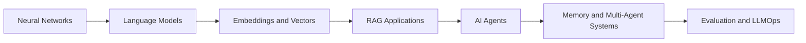

# AI Agents, RAG, and LLM Courses

A focused learning collection for building practical skills in neural networks, language models, retrieval-augmented generation (RAG), AI agents, and LLM operations.

!!! tip "Recommended route"
    Start with neural networks and language modeling, learn embeddings and vector databases, then build RAG applications before moving into browser agents, evaluation, memory, and multi-agent systems.

## Learning Path

## Foundations

| # | Course | Focus | Link |
| --- | --- | --- | --- |
| 1 | Neural Networks Zero to Hero | Neural network fundamentals and implementation | [Start course](https://lnkd.in/gPy8PCSg) |
| 2 | Language Modeling From Scratch | Build and understand language models | [Start course](https://lnkd.in/g84KRW96) |
| 3 | Hugging Face Agent Course | Agent concepts and implementation with Hugging Face | [Start course](https://lnkd.in/gmTftTXV) |
| 4 | MCP with Anthropic | Model Context Protocol fundamentals | [Start course](https://lnkd.in/geffcwdq) |

## Embeddings, Vector Databases, and RAG

| # | Course | Focus | Link |
| --- | --- | --- | --- |
| 5 | Building Vector Databases with Pinecone | Vector search and Pinecone workflows | [Start course](https://lnkd.in/gCS4sd7Y) |
| 6 | Vector Databases: From Embeddings to Apps | Connect embeddings and vector search to applications | [Start course](https://lnkd.in/gm9HR6_2) |
| 7 | DeepLearning.AI RAG Course | Retrieval-augmented generation patterns | [Start course](https://lnkd.in/gy7HjASS) |
| 8 | Building and Evaluating RAG Applications | Build, test, and measure RAG systems | [Start course](https://lnkd.in/g2qC9-mh) |

!!! note
    A practical RAG project usually combines document loading, chunking, embeddings, vector retrieval, prompt construction, response generation, and evaluation.

## Agent Engineering

| # | Course | Focus | Link |
| --- | --- | --- | --- |
| 9 | Agent Memory | Short-term and long-term memory patterns | [Start course](https://lnkd.in/gNFpC542) |
| 10 | Building Browser Agents | Agents that interact with web browsers | [Start course](https://lnkd.in/gsMmCifQ) |
| 11 | Computer Use with Anthropic | Computer-use models and agent interaction | [Start course](https://lnkd.in/gMUWg7Fa) |
| 12 | Multi-Agent Use | Coordinating multiple specialized agents | [Start course](https://lnkd.in/gU9DY9kj) |
| 13 | Agent Design Patterns | Reusable patterns for reliable agent systems | [Start course](https://lnkd.in/gzKvx5A4) |
| 14 | Multi-Agent Systems | Architectures for multi-agent applications | [Start course](https://lnkd.in/gUayts9s) |

## Reliability, Evaluation, and Operations

| # | Course | Focus | Link |
| --- | --- | --- | --- |
| 15 | LLMOps | Deploying, monitoring, and operating LLM systems | [Start course](https://lnkd.in/g7bHU37w) |
| 16 | Evaluating AI Agents | Test agent quality, safety, and reliability | [Start course](https://lnkd.in/gHJtwF5s) |
| 17 | Improving LLM Accuracy | Techniques for more accurate model responses | [Start course](https://lnkd.in/gsE-4FvY) |
| 18 | Berkeley Agent MOOC | University-level agent foundations | [Start course](https://lnkd.in/gqyKWE3A) |
| 19 | Berkeley Advanced Agents MOOC | Advanced agent architectures and research | [Start course](https://lnkd.in/gydt98kW) |

## Suggested Projects

=== "RAG assistant"
    Build a document question-answering assistant with embeddings, a vector database, citations, and an evaluation dataset.

=== "Browser testing agent"
    Create an agent that navigates a test application, uses stable locators, records actions, and reports failures for review.

=== "Multi-agent QA workflow"
    Combine a test-generation agent, locator agent, and failure-analysis agent behind structured schemas and deterministic tests.

=== "LLM evaluation dashboard"
    Compare prompts and models using a fixed test set, answer-quality scores, latency, token usage, and failure categories.

## Practical Checklist

- Define the task and success criteria before selecting a model.
- Keep prompts, schemas, tools, and evaluation data version-controlled.
- Prefer structured outputs when agents communicate with software.
- Test retrieval quality separately from generation quality in RAG systems.
- Add timeouts, retries, logging, and traceable tool calls to agent workflows.
- Avoid sending secrets or sensitive personal data to external model APIs.
- Re-evaluate quality after changing prompts, models, tools, or source documents.

## Course Links

- [Neural Networks Zero to Hero](https://lnkd.in/gPy8PCSg)
- [Language Modeling From Scratch](https://lnkd.in/g84KRW96)
- [Hugging Face Agent Course](https://lnkd.in/gmTftTXV)
- [MCP with Anthropic](https://lnkd.in/geffcwdq)
- [Building Vector Databases with Pinecone](https://lnkd.in/gCS4sd7Y)
- [Vector Databases from Embeddings to Apps](https://lnkd.in/gm9HR6_2)
- [Agent Memory](https://lnkd.in/gNFpC542)
- [DeepLearning.AI RAG Course](https://lnkd.in/gy7HjASS)
- [Building and Evaluating RAG Applications](https://lnkd.in/g2qC9-mh)
- [Building Browser Agents](https://lnkd.in/gsMmCifQ)
- [LLMOps](https://lnkd.in/g7bHU37w)
- [Evaluating AI Agents](https://lnkd.in/gHJtwF5s)
- [Computer Use with Anthropic](https://lnkd.in/gMUWg7Fa)
- [Multi-Agent Use](https://lnkd.in/gU9DY9kj)
- [Improving LLM Accuracy](https://lnkd.in/gsE-4FvY)
- [Agent Design Patterns](https://lnkd.in/gzKvx5A4)
- [Multi-Agent Systems](https://lnkd.in/gUayts9s)
- [Berkeley Agent MOOC](https://lnkd.in/gqyKWE3A)
- [Berkeley Advanced Agents MOOC](https://lnkd.in/gydt98kW)

LLM Model lIke GPT , LLM Model testing
New version of application

Job Details
* Location: Gurugram
* Work Mode: Hybrid (3 days WFO)
* Experience: 7+ Years
* Employment Type: Full-Time

What You’ll Work On

* Design and execute LLM evaluation frameworks (LangSmith, DeepEval, etc.)
* Measure and improve metrics like F1 score, execution accuracy, latency, token cost
* Build and maintain golden datasets for AI regression testing
* Validate semantic search & retrieval systems (precision/recall, embeddings)
* Perform deep failure analysis across AI pipelines
* Develop API automation (Python + Pytest) and UI automation (Playwright)
* Monitor systems using Grafana & structured logs to detect hallucinations and bottlenecks
* Implement AI guardrails, validation rules & security checks for safe query execution

Tech Stack & Skills

* AI/LLM Testing: RAG pipelines, NLP systems, evaluation frameworks
* Languages: Python (must-have), JavaScript/TypeScript (good to have)
* Automation: REST API testing, Pytest, Playwright
* Data & Search: Vector DBs (Pinecone, Milvus), embeddings, hybrid search
* SQL: Strong query validation & data verification skills
* Tools: Git, Docker, CI/CD, Grafana/Prometheus

Domain Expertise (Preferred)

* BFSI (Banking, Financial Services, Insurance)
* Data security, compliance, enterprise-grade systems

Nice to Have

* Experience with LangGraph, Neo4j, or graph-based systems
* Exposure to OpenAI / Anthropic / Google LLMs
* Understanding of multi-service architectures & system reliability
Core Skillset:
* 		Agentic AI  LangGraph / LangChain / LangSmith
* 		LLMs  OpenAI / Anthropic Claude / Azure OpenAI / Prompt Engineering
* 		Vector DB – pgvector / Pinecone / Weaviate / ChromaDB
* 		Workflow Orchestration – Temporal.io / Airflow
* 		Browser Automation – Playwright / Selenium
* 		REST APIs – Design, Integration, OAuth2, Webhooks
* 		Cloud – AWS / Azure / GCP
* 		Languages – Python / TypeScript / SQL

Description:
* Build and execute automated tests for AI/LLM systems
* Validate GenAI outputs including accuracy, consistency, and edge cases
* Analyze logs, datasets, and responses to identify issues
* Debug AI system behaviour end-to-end
* Contribute to LLM-assisted test case generation workflows
* Write scripts for parsing data, logs, and APIs
* Analyze raw outputs and logs using code
Required Skills:
* Strong coding skills (Python preferred)
* Ability to write scripts for parsing data, logs, and APIs
* Experience with test automation (API testing, automation scripts)
* Hands-on experience with GenAI / LLM systems
* Experience with prompts, outputs validation, and real implementations