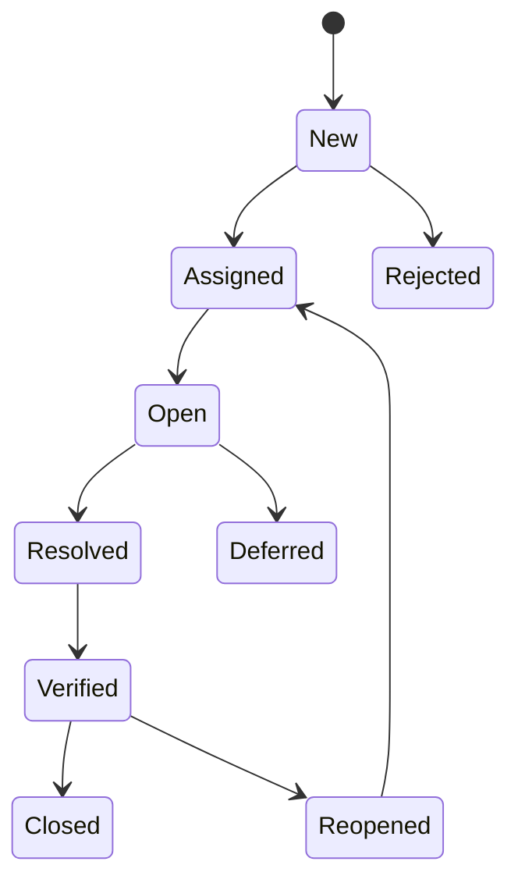

# Manual Testing Interview Questions

A structured manual testing interview guide based on the supplied **Manual and Automation Testing Part I: Questions and Answers** PDF. The questions are organized by topic so you can revise concepts quickly and practice explaining them with examples.

!!! note
    Use these answers as interview preparation. Adapt examples to your own projects and verify tool-specific details against current official documentation.

## Testing Fundamentals

### 1. Why do you want to pursue a career in software testing?

Software quality is essential for a product to succeed in the market. Testing verifies that a product behaves as expected, meets requirements, protects user data, and provides a reliable user experience. I prefer quality and dependable behavior over a product that simply has many features, which is why I chose software testing.

### 2. Why should we test software?

Testing helps verify that the product meets customer expectations, features work correctly, personal information is protected, and serious defects are found before release. It also provides stakeholders with evidence about the product's quality and risks.

### 3. What is software testing?

Software testing is the process of evaluating an application to find defects and verify that its behavior matches specified requirements. It can be performed manually by following test steps or automatically by executing test scripts.

### 4. What is quality?

Quality is the degree to which a product or service is reliable, useful, and able to meet or exceed user expectations and defined requirements.

### 5. What is performance?

Performance measures how efficiently and consistently a product produces results. Important factors include response time, throughput, resource usage, scalability, and stability.

### 6. What is the difference between verification and validation?

| Verification | Validation |
| --- | --- |
| Checks whether work products meet specified requirements. | Checks whether the finished product meets user needs. |
| Reviews documents, designs, and code without executing the application. | Executes the application to confirm expected behavior. |
| Asks: "Are we building the product right?" | Asks: "Are we building the right product?" |

### 7. What are the seven principles of testing?

1. Testing shows the presence of defects, not their absence.
2. Exhaustive testing is impossible.
3. Testing early saves time and cost.
4. Defects cluster in a small number of modules.
5. Repeating the same tests can become ineffective: the pesticide paradox.
6. Testing is context dependent.
7. A system with no known errors is not necessarily useful or correct.

## Applications and Test Levels

### 8. What are desktop applications?

Desktop applications are installed on a client machine and use local resources such as CPU, memory, storage, printers, and scanners. Examples include file explorers, office applications, and desktop browsers.

### 9. How do you test a desktop application?

Test the user interface, menus, controls, workflows, installation, file handling, error handling, resource usage, printer or scanner integration, compatibility, and recovery behavior.

### 10. What are web applications?

Web applications are hosted on a server and accessed through a browser and network connection. The browser sends requests over HTTP or HTTPS and displays the server response. Multiple users can access the application concurrently.

### 11. How do you test a web application?

Check functionality, navigation, redirects, broken links, forms, controls, validation, browser and device compatibility, performance, security, accessibility, session handling, and behavior under concurrent usage.

### 12. What are the four levels of testing?

1. **Unit testing:** Tests an individual function, class, or component.
2. **Integration testing:** Tests communication and data flow between components.
3. **System testing:** Tests the complete application end to end.
4. **Acceptance testing:** Confirms that the product satisfies business and user requirements.

### 13. What is integration testing?

Integration testing verifies that connected modules communicate correctly and exchange data as expected. For example, an e-commerce checkout test may verify the interaction between cart, order, payment, inventory, and notification services.

### 14. What is system testing?

System testing evaluates the complete integrated application against functional and non-functional requirements using realistic end-to-end scenarios.

### 15. What is acceptance testing?

Acceptance testing is performed by customers, users, or their representatives to decide whether the application is ready for release or production use.

## Testing Types

### 16. What is smoke testing?

Smoke testing is a broad, shallow check of a new build. It verifies that the application starts, major modules are available, navigation works, pages load, and there are no immediate blockers. A failed smoke test usually stops deeper testing.

### 17. What is sanity testing?

Sanity testing is a focused check after a bug fix, patch, or small change. It verifies the changed functionality and nearby areas before wider regression testing.

### 18. What is regression testing?

Regression testing checks that existing functionality has not been adversely affected by a code change, bug fix, configuration change, or new feature. Repetitive regression suites are good candidates for automation.

### 19. What is retesting?

Retesting verifies that a previously failed test now passes after the reported defect is fixed. It focuses on the original failure, while regression testing checks related and unrelated existing functionality.

### 20. What is exploratory testing?

Exploratory testing combines learning, test design, and execution. The tester explores the application, uses experience to investigate risks, records observations, and designs tests while learning the product.

### 21. What is ad-hoc testing?

Ad-hoc testing is informal testing without a predefined test case structure. It is useful for quickly probing risky areas, but important findings should be documented and converted into repeatable tests.

### 22. What is functional testing?

Functional testing verifies that features, business rules, controls, integrations, and workflows produce the expected results for valid and invalid inputs.

### 23. What is non-functional testing?

Non-functional testing evaluates qualities such as performance, security, usability, reliability, compatibility, scalability, portability, accessibility, and recovery.

### 24. What is black-box testing?

Black-box testing validates behavior without requiring knowledge of the internal implementation. It is based mainly on requirements and user-visible inputs and outputs.

### 25. What is white-box testing?

White-box testing uses knowledge of internal code, control flow, data flow, conditions, and implementation. Statement, branch, decision, and path coverage are common techniques.

### 26. What is grey-box testing?

Grey-box testing combines external behavior testing with partial knowledge of internal architecture, data flow, or implementation.

### 27. What is performance testing?

Performance testing measures response time, throughput, stability, and resource behavior under expected or varying workloads.

| Type | Purpose |
| --- | --- |
| Load testing | Measures behavior under expected and peak load. |
| Stress testing | Finds the point at which the system becomes unstable or fails. |
| Spike testing | Measures response to sudden load changes. |
| Endurance testing | Checks stability during sustained usage. |
| Volume testing | Measures behavior with large data volumes. |
| Scalability testing | Checks how the system behaves when resources or users scale up or down. |

### 28. What is security testing?

Security testing identifies weaknesses in authentication, authorization, session management, input handling, encryption, data protection, configuration, and access control. Testing must be authorized and performed in a controlled environment.

### 29. What is compatibility testing?

Compatibility testing verifies the application across supported browsers, operating systems, devices, networks, hardware configurations, screen sizes, and software versions.

### 30. What is localization testing?

Localization testing verifies language, date and time formats, currency, number formats, layout, input methods, and regional rules for a specific country or locale.

## Test Design and Documentation

### 31. What is a test scenario?

A test scenario is a high-level condition or feature to be evaluated, such as "Verify that a registered user can reset a password."

### 32. What is a test case?

A test case is a documented set of preconditions, test data, steps, expected results, actual results, status, and remarks used to verify a scenario.

### 33. What columns belong in a test case?

- Test case ID
- Requirement or RTM ID
- Scenario and description
- Preconditions
- Test steps
- Test data
- Expected result
- Actual result
- Status
- Remarks or defect ID

### 34. What is positive testing?

Positive testing uses valid inputs and expected user paths to confirm that the application performs the required behavior.

### 35. What is negative testing?

Negative testing uses invalid inputs, unexpected sequences, missing data, boundary values, and unauthorized actions to check that the application fails safely and provides useful feedback.

### 36. What are common test design techniques?

- Equivalence partitioning
- Boundary value analysis
- Decision table testing
- State transition testing
- Use-case testing
- Error guessing
- Pairwise or combinatorial testing

### 37. Give an equivalence partitioning example.

For a driving-license age rule of 18 to 49 years:

| Partition | Example | Result |
| --- | --- | --- |
| Below minimum | 17 | Invalid |
| Valid range | 18 to 49 | Valid |
| Above maximum | 50 | Invalid |

### 38. Give a boundary value analysis example.

For the same 18-to-49 rule, test values around the boundaries: `17, 18, 19, 48, 49, 50`. These values cover just outside, at, and just inside each boundary.

### 39. What is a decision table?

A decision table represents combinations of conditions and expected actions. For login, test valid and invalid username/password combinations and confirm whether access is granted or an error is shown.

### 40. What is an RTM?

A Requirement Traceability Matrix maps requirements to test scenarios and test cases. It helps demonstrate coverage and identify requirements without corresponding tests.

### 41. What is a test plan?

A test plan defines scope, objectives, features in and out of scope, approach, resources, schedule, environments, test data, risks, entry criteria, exit criteria, deliverables, and responsibilities.

### 42. What is a test environment?

A test environment is the hardware, software, network, data, services, tools, and configuration required to execute tests. It should represent production closely enough to make results meaningful.

## Defects and Bug Management

### 43. What is a defect?

A defect is a difference between actual behavior and expected behavior defined by requirements, acceptance criteria, design, or a reasonable user expectation.

### 44. Explain the defect life cycle.

A typical flow is:



The exact statuses vary by organization. A tester reports and verifies the issue, the team triages and assigns it, the developer resolves it, and the tester retests before closure.

### 45. What is defect severity?

Severity describes the technical or business impact of a defect. Common levels include blocker, critical, major, minor, and low.

### 46. What is defect priority?

Priority describes how urgently the organization should fix a defect. A low-severity branding error on a major launch page may have high priority, while a serious issue in a rarely used feature may be scheduled later.

### 47. What should a defect report contain?

- Clear summary
- Product, build, and environment
- Preconditions
- Reproducible steps
- Expected result
- Actual result
- Severity and priority
- Reproducibility
- Logs, screenshots, or video
- Related test case and requirement
- Assignee and current status

### 48. What is defect triage?

Defect triage is the team review used to confirm validity, assess impact and risk, set priority and severity, assign ownership, and decide the target release.

### 49. What is defect cascading?

Defect cascading occurs when one defect prevents a later area from being exercised, hiding or causing additional defects that appear after the first issue is fixed.

### 50. What is the pesticide paradox?

If the same tests are repeated without improvement, they may stop finding new defects. Refresh the suite with new data, scenarios, environments, and risk-based tests.

## API, Database, and Web Testing

### 51. What is API testing?

API testing validates service behavior directly, including request and response data, status codes, headers, authentication, authorization, error handling, performance, reliability, and security.

### 52. What HTTP methods are common in REST APIs?

`GET` retrieves data, `POST` creates a resource or submits an operation, `PUT` replaces a resource, `PATCH` partially updates a resource, and `DELETE` removes a resource.

### 53. What do HTTP status code classes mean?

- `1xx`: Informational
- `2xx`: Success
- `3xx`: Redirection
- `4xx`: Client error
- `5xx`: Server error

### 54. What is the difference between POST and PUT?

POST commonly creates a new resource or triggers an operation and is generally not idempotent. PUT commonly creates or replaces a resource at a known URI and is intended to be idempotent.

### 55. What tools are used for API testing?

Postman, SoapUI, REST Assured, Apache JMeter, Katalon Studio, and Citrus are examples. Choose tools based on protocol, language, reporting, CI integration, and team skills.

### 56. What is database testing?

Database testing validates schema, tables, views, constraints, indexes, stored procedures, triggers, data integrity, transactions, CRUD operations, and consistency between the database and application.

### 57. What are DDL and DML?

DDL defines database structures using commands such as `CREATE`, `ALTER`, `DROP`, and `TRUNCATE`. DML manipulates data using commands such as `INSERT`, `UPDATE`, and `DELETE`.

### 58. What is a primary key and foreign key?

A primary key uniquely identifies each row and does not allow null values. A foreign key references a key in another table and enforces a relationship between records.

### 59. What are SQL joins?

Common joins are inner, left, right, full, and self joins. They combine related rows from tables using a matching condition.

```sql
SELECT employee.name, department.name
FROM employee
INNER JOIN department
    ON employee.department_id = department.id;
```

### 60. What are cookies and sessions?

Cookies are client-side data sent with requests to retain preferences or state. Sessions represent server-side user state, usually identified through a session cookie. Test expiry, tampering, secure flags, logout, concurrent sessions, and cross-browser behavior.

## Automation and Delivery

### 61. When should a test be automated?

Automate stable, repeatable, high-value tests such as smoke, regression, data-driven, API, and cross-browser checks. Consider maintenance cost, tool support, test stability, execution frequency, and reporting needs.

### 62. When is automation not the best choice?

Manual testing is often better for usability, exploratory investigation, visual judgment, rapidly changing features, one-time checks, and scenarios where automation effort exceeds the value.

### 63. What can cause an automation script to fail?

Unstable locators, timing issues, network failures, changed requirements, incompatible browser or driver versions, missing dependencies, bad test data, environment instability, unhandled exceptions, and incorrect assertions.

### 64. What is data-driven testing?

Data-driven testing runs the same test logic with multiple data sets loaded from sources such as CSV, Excel, JSON, databases, or generated fixtures.

### 65. What is a test harness?

A test harness is the collection of test data, scripts, drivers, stubs, configuration, and execution tools used to run tests and collect results.

### 66. What is Jenkins?

Jenkins is an automation server used to build, test, and deploy software. It can run test suites after code changes and publish results to the development team.

### 67. What is Git?

Git is a distributed version-control system used to track changes, collaborate through branches, review commits, and restore earlier versions of a codebase.

### 68. What is Docker?

Docker packages an application and its dependencies into a portable container image so it can run consistently across environments.

## Practical Test Case Questions

### 69. What would you test in an OTP application?

- OTP arrives within the allowed time.
- OTP is delivered only to the registered channel.
- Expired and previously used OTPs are rejected.
- Resend generates a new OTP and invalidates the old one where required.
- Retry limits and lockout behavior work correctly.
- Invalid length, characters, case, and blank values are handled.
- OTP cannot be reused for another transaction.
- Error messages do not expose sensitive information.

### 70. How would you test a pencil?

Check dimensions, material strength, graphite quality, writing clarity, performance on different surfaces, erasability, sharpening, behavior after exposure to water or dust, printing and spelling, and whether the graphite is already cracked or brittle.

### 71. How would you test an online payment flow?

Cover successful and failed card, UPI, wallet, and bank-transfer payments; invalid data; OTP; timeouts; duplicate submissions; cancellation; retries; refunds; reconciliation; notifications; currency; authorization; audit logs; and data protection.

### 72. How would you test a file-sharing application?

Test upload, download, preview, sharing permissions, link expiry, file-size and format limits, virus scanning, concurrent access, interrupted transfers, storage quota, subscription limits, password reset, notifications, audit history, and mobile/browser compatibility.

### 73. How would you test a mobile application?

Test installation, upgrade, permissions, orientation, gestures, network changes, calls and notifications, background and foreground transitions, battery and memory usage, different OS versions and devices, offline behavior, accessibility, security, and app-store package integrity.

### 74. How would you test a CAPTCHA?

Verify the challenge appears where required, valid input succeeds, invalid and expired challenges fail, refresh creates a new challenge, audio or accessibility alternatives work, repeated attempts are rate limited, and the implementation resists simple automated replay without blocking legitimate users.

## Interview and Scenario Questions

### 75. How do you decide what to test first when time is limited?

Use risk-based prioritization. Start with business-critical workflows, changed areas, integrations, security-sensitive functions, high-usage paths, and defects that could block release. Communicate coverage and remaining risk clearly to stakeholders.

### 76. How do you know when testing is enough?

Testing can stop when exit criteria are met: planned critical scenarios are executed, acceptable coverage is achieved, blocking risks are addressed, key defects are resolved or accepted, performance is within agreed limits, and stakeholders understand residual risk.

### 77. How do you handle disagreement with a developer?

Stay objective and collaborative. Reproduce the issue, compare behavior with requirements and evidence, share clear steps and logs, discuss impact, involve the product owner when the requirement is unclear, and record the agreed decision.

### 78. What are common testing challenges?

Incomplete requirements, limited time, unstable environments, changing scope, insufficient test data, complex integrations, difficult defect reproduction, repeated regression work, and deciding which risks matter most.

### 79. What is risk-based testing?

Risk-based testing prioritizes effort according to business impact, technical complexity, likelihood of failure, change history, data sensitivity, and frequency of use.

### 80. What is the difference between QA and QC?

QA is process-oriented and focuses on preventing defects through standards, reviews, planning, and improvement. QC is product-oriented and focuses on finding defects in the implemented product.

## Quick Revision Topics

The supplied reference also covers these interview areas:

- STLC and SDLC phases
- V-model, Agile, Scrum, sprints, epics, and backlogs
- Entry and exit criteria
- Alpha, beta, UAT, and installation testing
- Usability, accessibility, localization, and compatibility
- Reliability, recovery, interruption, and portability testing
- Statement, branch, decision, condition, and path coverage
- Mutation, fuzz, error guessing, and error seeding
- Test metrics, defect density, defect age, and code coverage
- Configuration management, CI/CD, and release strategies
- REST constraints, SOAP, XML, JSON, cookies, and web services
- SQL queries, normalization, CRUD, indexes, and stored procedures
- Linux commands, networking, OSI layers, HTTP, HTTPS, and proxies
- Java, OOP, collections, JVM, JRE, JDK, Tomcat, and frameworks
- Cloud, AWS services, Docker, data warehousing, ETL, and Big Data
- Domain testing for banking, insurance, healthcare, e-commerce, payments, gaming, and social media
- Behavioral questions about teamwork, pressure, ambiguity, learning, ownership, and communication
