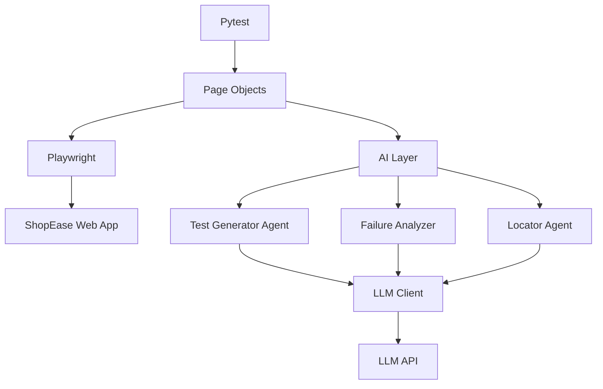

# Python AI Automation Testing Lab

Reference material from the [Hitesh Python AI Automation repository](https://github.com/hiteshkarn12/hitesh-python-ai-automation/tree/feature/ai-foundation).

This project is a Python-based SDET automation framework built with **Pytest**, **Playwright**, and **AI/LLM technologies**. It uses a real e-commerce practice application to demonstrate modern test automation architecture and AI-assisted quality engineering.

!!! note
    This page documents the public `feature/ai-foundation` branch. The original repository and its files remain the source of truth; use the links below to review the latest implementation.

## Technology Stack

- Python
- Pytest
- Playwright
- Pydantic
- OpenAI API
- Git and GitHub
- Page Object Model
- AI agents

## Project Architecture

```text
hitesh-sdet-lab-python/
|
|-- ai/
|   |-- agents/
|   |   |-- test_generator.py
|   |   |-- failure_analyzer.py
|   |   |-- locator_agent.py
|   |-- tools/
|   |   |-- browser_tool.py
|   |   |-- test_tool.py
|   |-- llm_client.py
|   |-- prompts.py
|   |-- schemas.py
|
|-- pages/
|   |-- home_page.py
|   |-- login_page.py
|   |-- dashboard_page.py
|   |-- products_page.py
|   |-- cart_page.py
|
|-- tests/
|   |-- test_home.py
|   |-- test_login.py
|   |-- test_products.py
|   |-- test_browser.py
|   |-- test_first.py
|   |-- test_fixture.py
|   |-- test_lab_navigation.py
|   |-- test_ai.py
|   |-- test_ai_architecture.py
|   |-- test_ai_schema.py
|   |-- test_ai_agent.py
|
|-- utils/
|   |-- config.py
|-- conftest.py
|-- pytest.ini
|-- requirements.txt
|-- .gitignore
|-- README.md
```

## Automation Architecture



## Current Capabilities

### Web Automation

- Browser automation with Playwright
- Pytest test execution
- Page Object Model implementation
- Environment-based credentials
- Login automation
- Dashboard navigation
- Product navigation
- Add-product-to-cart flow
- Cart validation
- Stable locator strategy

### AI Foundation

The project currently provides the foundation for:

- LLM integration
- AI test generation
- AI failure analysis
- AI locator analysis
- Browser tools
- Test execution tools
- Structured AI output using Pydantic

The AI components are being developed incrementally and can be tested without making real LLM API calls.

## Locator Strategy

The framework prioritizes stable Playwright locators in this order:

- `get_by_role()`
- `get_by_label()`
- `get_by_test_id()`
- Stable attributes
- CSS selectors

## Test Coverage Areas

The repository includes tests for:

- Basic test execution
- Fixtures and browser setup
- Home page behavior
- Login flow
- Product navigation and cart behavior
- Lab navigation
- AI module availability
- AI architecture components
- Pydantic AI schemas
- AI agent behavior

## AI Development Roadmap

```text
Python + Pytest
      |
      v
Playwright Framework
      |
      v
Page Object Model
      |
      v
Real Application Tests
      |
      v
AI Architecture
      |
      v
Pydantic Structured Output
      |
      v
LLM Integration
      |
      v
AI Test Generator
      |
      v
AI Failure Analyzer
      |
      v
AI Locator Agent
      |
      v
Browser / Test Tools
      |
      v
AI + Playwright
      |
      v
Agentic QA Automation
```

## Source Files

### AI Agents

- [Test Generator](https://github.com/hiteshkarn12/hitesh-python-ai-automation/blob/feature/ai-foundation/ai/agents/test_generator.py)
- [Failure Analyzer](https://github.com/hiteshkarn12/hitesh-python-ai-automation/blob/feature/ai-foundation/ai/agents/failure_analyzer.py)
- [Locator Agent](https://github.com/hiteshkarn12/hitesh-python-ai-automation/blob/feature/ai-foundation/ai/agents/locator_agent.py)

### AI Core and Tools

- [LLM Client](https://github.com/hiteshkarn12/hitesh-python-ai-automation/blob/feature/ai-foundation/ai/llm_client.py)
- [Prompts](https://github.com/hiteshkarn12/hitesh-python-ai-automation/blob/feature/ai-foundation/ai/prompts.py)
- [Pydantic Schemas](https://github.com/hiteshkarn12/hitesh-python-ai-automation/blob/feature/ai-foundation/ai/schemas.py)
- [Browser Tool](https://github.com/hiteshkarn12/hitesh-python-ai-automation/blob/feature/ai-foundation/ai/tools/browser_tool.py)
- [Test Tool](https://github.com/hiteshkarn12/hitesh-python-ai-automation/blob/feature/ai-foundation/ai/tools/test_tool.py)

### Page Objects

- [Home Page](https://github.com/hiteshkarn12/hitesh-python-ai-automation/blob/feature/ai-foundation/pages/home_page.py)
- [Login Page](https://github.com/hiteshkarn12/hitesh-python-ai-automation/blob/feature/ai-foundation/pages/login_page.py)
- [Dashboard Page](https://github.com/hiteshkarn12/hitesh-python-ai-automation/blob/feature/ai-foundation/pages/dashboard_page.py)
- [Products Page](https://github.com/hiteshkarn12/hitesh-python-ai-automation/blob/feature/ai-foundation/pages/products_page.py)
- [Cart Page](https://github.com/hiteshkarn12/hitesh-python-ai-automation/blob/feature/ai-foundation/pages/cart_page.py)

### Tests and Configuration

- [Test suite](https://github.com/hiteshkarn12/hitesh-python-ai-automation/tree/feature/ai-foundation/tests)
- [Fixtures](https://github.com/hiteshkarn12/hitesh-python-ai-automation/blob/feature/ai-foundation/conftest.py)
- [Pytest configuration](https://github.com/hiteshkarn12/hitesh-python-ai-automation/blob/feature/ai-foundation/pytest.ini)
- [Environment configuration](https://github.com/hiteshkarn12/hitesh-python-ai-automation/blob/feature/ai-foundation/utils/config.py)
- [Dependencies](https://github.com/hiteshkarn12/hitesh-python-ai-automation/blob/feature/ai-foundation/requirements.txt)
- [Complete source repository](https://github.com/hiteshkarn12/hitesh-python-ai-automation/tree/feature/ai-foundation)

## Suggested Learning Path

1. Learn Python and Pytest fundamentals.
2. Build browser tests with Playwright.
3. Organize tests with the Page Object Model.
4. Automate a real application workflow.
5. Add structured output with Pydantic.
6. Introduce LLM integration without coupling tests to live API calls.
7. Build test-generation, failure-analysis, and locator agents.
8. Combine AI, Playwright, and test tools into agentic QA automation.
